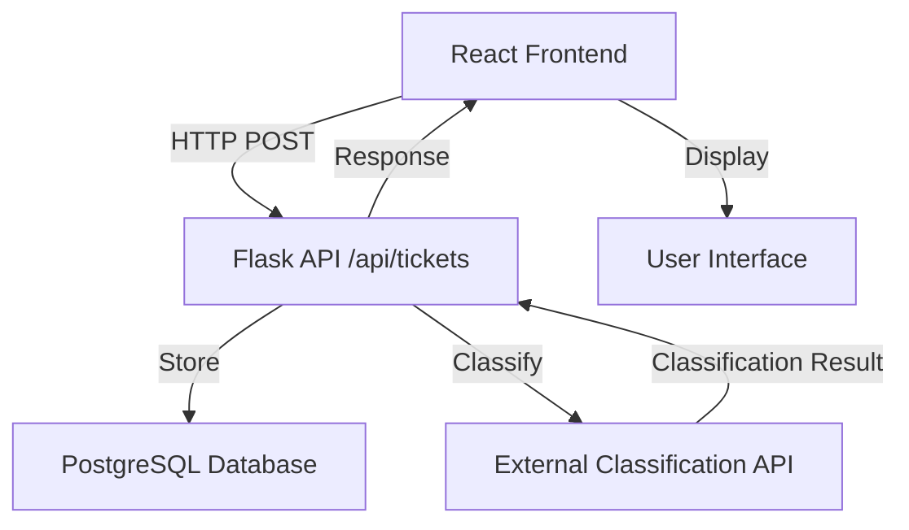
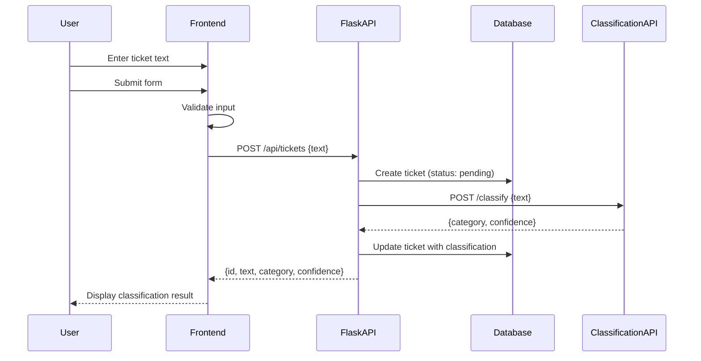

# Design Document: Ticket Text Classification

## Overview

The ticket text classification feature enables users to submit text through a web interface, which is then sent to a backend API for classification. The system consists of a React frontend form component that captures user input, a Flask backend endpoint that interfaces with an external classification API, and a PostgreSQL database to persist tickets with their classifications. The feature supports real-time feedback, error handling, and displays classification results to users.

## Architecture



## Main Algorithm/Workflow



## Components and Interfaces

### Frontend Component: TicketClassificationForm

**Purpose**: Capture user input and display classification results

**Interface**:
```typescript
interface TicketClassificationFormProps {
  onSubmitSuccess?: (ticket: ClassifiedTicket) => void;
  onSubmitError?: (error: Error) => void;
}

interface ClassifiedTicket {
  id: string;
  text: string;
  category: string;
  confidence: number;
  createdAt: string;
}
```

**Responsibilities**:
- Render text input form with validation
- Handle form submission and loading states
- Display classification results
- Handle and display errors

### Backend Blueprint: tickets_bp

**Purpose**: Handle ticket creation and classification requests

**Interface**:
```python
@tickets_bp.route('/tickets', methods=['POST'])
def create_ticket() -> tuple[dict, int]:
    """
    Create a new ticket and classify its text.
    
    Request Body:
        {
            "text": str  # Required, 1-5000 characters
        }
    
    Response:
        {
            "id": str,
            "text": str,
            "category": str,
            "confidence": float,
            "status": str,
            "created_at": str
        }
    """
    pass

@tickets_bp.route('/tickets/<ticket_id>', methods=['GET'])
def get_ticket(ticket_id: str) -> tuple[dict, int]:
    """Get a ticket by ID with its classification."""
    pass

@tickets_bp.route('/tickets', methods=['GET'])
def list_tickets() -> tuple[dict, int]:
    """List all tickets with pagination."""
    pass
```

**Responsibilities**:
- Validate incoming ticket data
- Persist tickets to database
- Call external classification API
- Return formatted responses

### Service: ClassificationService

**Purpose**: Interface with external classification API

**Interface**:
```python
class ClassificationService:
    def __init__(self, api_url: str, api_key: str):
        """Initialize with API credentials."""
        pass
    
    def classify_text(self, text: str) -> ClassificationResult:
        """
        Classify text using external API.
        
        Args:
            text: The text to classify
            
        Returns:
            ClassificationResult with category and confidence
            
        Raises:
            ClassificationAPIError: If API call fails
        """
        pass
```

**Responsibilities**:
- Make HTTP requests to classification API
- Handle API authentication
- Parse and validate API responses
- Implement retry logic and error handling

## Data Models

### Frontend: ClassifiedTicket

```typescript
interface ClassifiedTicket {
  id: string;
  text: string;
  category: string;
  confidence: number;
  status: 'pending' | 'classified' | 'failed';
  createdAt: string;
  updatedAt: string;
}

interface CreateTicketRequest {
  text: string;
}

interface CreateTicketResponse {
  ticket: ClassifiedTicket;
}
```

**Validation Rules**:
- `text`: Required, 1-5000 characters, non-empty after trim
- `category`: Non-empty string when status is 'classified'
- `confidence`: Number between 0 and 1 when status is 'classified'

### Backend: Ticket Model

```python
class Ticket(db.Model):
    __tablename__ = 'tickets'
    
    id = db.Column(db.String(36), primary_key=True, default=lambda: str(uuid.uuid4()))
    text = db.Column(db.Text, nullable=False)
    category = db.Column(db.String(100), nullable=True)
    confidence = db.Column(db.Float, nullable=True)
    status = db.Column(db.String(20), nullable=False, default='pending')
    created_at = db.Column(db.DateTime, nullable=False, default=datetime.utcnow)
    updated_at = db.Column(db.DateTime, nullable=False, default=datetime.utcnow, onupdate=datetime.utcnow)
    
    def to_dict(self) -> dict:
        """Serialize to dictionary."""
        return {
            'id': self.id,
            'text': self.text,
            'category': self.category,
            'confidence': self.confidence,
            'status': self.status,
            'created_at': self.created_at.isoformat(),
            'updated_at': self.updated_at.isoformat()
        }
```

**Validation Rules**:
- `text`: Required, max 5000 characters
- `category`: Optional, max 100 characters
- `confidence`: Optional, between 0.0 and 1.0
- `status`: One of ['pending', 'classified', 'failed']

## Key Functions with Formal Specifications

### Frontend: submitTicket()

```typescript
async function submitTicket(text: string): Promise<ClassifiedTicket>
```

**Preconditions:**
- `text` is non-null and non-empty after trimming
- `text.length` is between 1 and 5000 characters
- Network connection is available

**Postconditions:**
- Returns valid `ClassifiedTicket` object on success
- Throws `ValidationError` if input is invalid
- Throws `NetworkError` if API call fails
- No side effects on input parameter

**Loop Invariants:** N/A (no loops)

### Backend: create_ticket()

```python
def create_ticket(request_data: dict) -> tuple[dict, int]
```

**Preconditions:**
- `request_data` contains 'text' key
- `request_data['text']` is a string with 1-5000 characters
- Database connection is active
- Classification API is configured

**Postconditions:**
- Returns tuple of (response_dict, status_code)
- `status_code` is 201 on success, 400 on validation error, 500 on server error
- New ticket record exists in database
- If classification succeeds: ticket has category and confidence
- If classification fails: ticket status is 'failed'

**Loop Invariants:** N/A (no loops)

### Backend: classify_text()

```python
def classify_text(text: str) -> ClassificationResult
```

**Preconditions:**
- `text` is non-empty string
- Classification API URL and credentials are configured
- API endpoint is reachable

**Postconditions:**
- Returns `ClassificationResult` with category and confidence on success
- Raises `ClassificationAPIError` on API failure
- Raises `ValidationError` if API response is malformed
- No mutations to input parameter

**Loop Invariants:** N/A (no loops)

## Algorithmic Pseudocode

### Main Ticket Creation Algorithm

```typescript
ALGORITHM createTicketWorkflow(text: string): Promise<ClassifiedTicket>
INPUT: text of type string
OUTPUT: classifiedTicket of type ClassifiedTicket

BEGIN
  ASSERT text.trim().length >= 1 AND text.trim().length <= 5000
  
  // Step 1: Validate input
  validatedText ← validateTicketText(text)
  
  // Step 2: Send to backend API
  response ← await fetch('http://localhost:5000/api/tickets', {
    method: 'POST',
    headers: { 'Content-Type': 'application/json' },
    body: JSON.stringify({ text: validatedText })
  })
  
  // Step 3: Handle response
  IF NOT response.ok THEN
    errorData ← await response.json()
    THROW new APIError(errorData.message)
  END IF
  
  // Step 4: Parse and return result
  data ← await response.json()
  classifiedTicket ← parseTicketResponse(data)
  
  ASSERT classifiedTicket.id IS NOT NULL
  ASSERT classifiedTicket.category IS NOT NULL OR classifiedTicket.status = 'failed'
  
  RETURN classifiedTicket
END
```

**Preconditions:**
- text is a valid string
- Backend API is running and accessible
- User has network connectivity

**Postconditions:**
- Returns ClassifiedTicket with all required fields populated
- Ticket is persisted in database
- Classification has been attempted (may succeed or fail)

**Loop Invariants:** N/A

### Backend Ticket Processing Algorithm

```python
ALGORITHM processTicketCreation(requestData: dict): tuple[dict, int]
INPUT: requestData containing text field
OUTPUT: tuple of (responseDict, statusCode)

BEGIN
  // Step 1: Validate request
  IF 'text' NOT IN requestData THEN
    RETURN ({'error': 'text field required'}, 400)
  END IF
  
  text ← requestData['text'].strip()
  
  IF length(text) < 1 OR length(text) > 5000 THEN
    RETURN ({'error': 'text must be 1-5000 characters'}, 400)
  END IF
  
  // Step 2: Create ticket record
  ticket ← Ticket(
    id=generateUUID(),
    text=text,
    status='pending'
  )
  db.session.add(ticket)
  db.session.commit()
  
  // Step 3: Attempt classification
  TRY
    classificationResult ← classificationService.classify_text(text)
    
    ticket.category ← classificationResult.category
    ticket.confidence ← classificationResult.confidence
    ticket.status ← 'classified'
    
  CATCH ClassificationAPIError as e
    ticket.status ← 'failed'
    log.error(f"Classification failed: {e}")
  END TRY
  
  // Step 4: Update and return
  db.session.commit()
  
  ASSERT ticket.id IS NOT NULL
  ASSERT ticket.status IN ['classified', 'failed']
  
  RETURN (ticket.to_dict(), 201)
END
```

**Preconditions:**
- requestData is a dictionary
- Database session is active
- Classification service is initialized

**Postconditions:**
- Ticket record exists in database
- Response contains ticket data with status
- Status code is 201 on success, 400 on validation error
- Database transaction is committed or rolled back

**Loop Invariants:** N/A

### Classification API Call Algorithm

```python
ALGORITHM callClassificationAPI(text: string): ClassificationResult
INPUT: text to classify
OUTPUT: ClassificationResult with category and confidence

BEGIN
  ASSERT text IS NOT NULL AND length(text) > 0
  
  // Step 1: Prepare request
  headers ← {
    'Content-Type': 'application/json',
    'Authorization': f'Bearer {apiKey}'
  }
  
  payload ← {'text': text}
  
  // Step 2: Make API call with retry logic
  maxRetries ← 3
  retryCount ← 0
  
  WHILE retryCount < maxRetries DO
    ASSERT retryCount >= 0 AND retryCount < maxRetries
    
    TRY
      response ← httpClient.post(apiUrl, json=payload, headers=headers, timeout=10)
      
      IF response.status_code = 200 THEN
        data ← response.json()
        
        // Step 3: Validate response
        IF 'category' NOT IN data OR 'confidence' NOT IN data THEN
          THROW ValidationError('Invalid API response format')
        END IF
        
        IF data['confidence'] < 0.0 OR data['confidence'] > 1.0 THEN
          THROW ValidationError('Confidence must be between 0 and 1')
        END IF
        
        RETURN ClassificationResult(
          category=data['category'],
          confidence=data['confidence']
        )
      ELSE
        THROW ClassificationAPIError(f'API returned {response.status_code}')
      END IF
      
    CATCH (NetworkError, TimeoutError) as e
      retryCount ← retryCount + 1
      
      IF retryCount >= maxRetries THEN
        THROW ClassificationAPIError(f'Failed after {maxRetries} retries: {e}')
      END IF
      
      sleep(2^retryCount)  // Exponential backoff
    END TRY
  END WHILE
END
```

**Preconditions:**
- text is non-empty string
- apiUrl and apiKey are configured
- httpClient is initialized

**Postconditions:**
- Returns ClassificationResult with valid category and confidence (0-1)
- Raises ClassificationAPIError after max retries exceeded
- Raises ValidationError if API response is malformed

**Loop Invariants:**
- retryCount is always >= 0 and < maxRetries while loop continues
- Each iteration either returns successfully or increments retryCount

## Example Usage

### Frontend: Using the TicketClassificationForm Component

```typescript
// Example 1: Basic usage in a page component
import { TicketClassificationForm } from '@/components/TicketClassificationForm';

function TicketsPage() {
  const handleSuccess = (ticket: ClassifiedTicket) => {
    console.log('Ticket classified:', ticket);
    toast.success(`Classified as: ${ticket.category}`);
  };
  
  const handleError = (error: Error) => {
    console.error('Classification failed:', error);
    toast.error(error.message);
  };
  
  return (
    <div className="container mx-auto p-4">
      <h1 className="text-2xl font-bold mb-4">Submit a Ticket</h1>
      <TicketClassificationForm 
        onSubmitSuccess={handleSuccess}
        onSubmitError={handleError}
      />
    </div>
  );
}

// Example 2: Direct API call
async function classifyTicketText(text: string) {
  try {
    const response = await fetch('http://localhost:5000/api/tickets', {
      method: 'POST',
      headers: { 'Content-Type': 'application/json' },
      body: JSON.stringify({ text })
    });
    
    if (!response.ok) {
      throw new Error('Failed to classify ticket');
    }
    
    const ticket = await response.json();
    return ticket;
  } catch (error) {
    console.error('Error:', error);
    throw error;
  }
}

// Example 3: Using with React Query
import { useMutation } from '@tanstack/react-query';

function useCreateTicket() {
  return useMutation({
    mutationFn: async (text: string) => {
      const response = await fetch('http://localhost:5000/api/tickets', {
        method: 'POST',
        headers: { 'Content-Type': 'application/json' },
        body: JSON.stringify({ text })
      });
      
      if (!response.ok) throw new Error('Failed to create ticket');
      return response.json();
    }
  });
}
```

### Backend: Using the Tickets Blueprint

```python
# Example 1: Creating a ticket via API
# POST /api/tickets
# Request body:
{
  "text": "My printer is not working and I need help urgently"
}

# Response (201 Created):
{
  "id": "a1b2c3d4-e5f6-7890-abcd-ef1234567890",
  "text": "My printer is not working and I need help urgently",
  "category": "hardware_issue",
  "confidence": 0.92,
  "status": "classified",
  "created_at": "2024-01-15T10:30:00Z",
  "updated_at": "2024-01-15T10:30:00Z"
}

# Example 2: Retrieving a ticket
# GET /api/tickets/a1b2c3d4-e5f6-7890-abcd-ef1234567890
# Response (200 OK):
{
  "id": "a1b2c3d4-e5f6-7890-abcd-ef1234567890",
  "text": "My printer is not working and I need help urgently",
  "category": "hardware_issue",
  "confidence": 0.92,
  "status": "classified",
  "created_at": "2024-01-15T10:30:00Z",
  "updated_at": "2024-01-15T10:30:00Z"
}

# Example 3: Listing tickets with pagination
# GET /api/tickets?page=1&per_page=10
# Response (200 OK):
{
  "tickets": [...],
  "total": 45,
  "page": 1,
  "per_page": 10,
  "pages": 5
}
```

## Correctness Properties

### Property 1: Input Validation
**∀ text ∈ Tickets**: `1 ≤ length(text.trim()) ≤ 5000`

Every ticket text must be between 1 and 5000 characters after trimming whitespace.

### Property 2: Classification Confidence Range
**∀ ticket ∈ ClassifiedTickets**: `ticket.status = 'classified' ⟹ 0 ≤ ticket.confidence ≤ 1`

If a ticket is successfully classified, its confidence score must be between 0 and 1 inclusive.

### Property 3: Status Consistency
**∀ ticket ∈ Tickets**: `ticket.status ∈ {'pending', 'classified', 'failed'}`

Every ticket must have exactly one of three valid status values.

### Property 4: Classification Completeness
**∀ ticket ∈ Tickets**: `ticket.status = 'classified' ⟹ (ticket.category ≠ null ∧ ticket.confidence ≠ null)`

If a ticket's status is 'classified', it must have both a category and confidence value.

### Property 5: Idempotency
**∀ text ∈ Strings**: `classify(text) = classify(text)`

Classifying the same text multiple times should produce consistent results (within API variance).

### Property 6: Database Persistence
**∀ ticket ∈ CreatedTickets**: `∃ record ∈ Database: record.id = ticket.id`

Every ticket returned from the API must exist in the database.

### Property 7: API Response Structure
**∀ response ∈ APIResponses**: `response.status = 201 ⟹ response.body contains {id, text, category, confidence, status, created_at, updated_at}`

Successful ticket creation responses must include all required fields.

## Error Handling

### Error Scenario 1: Invalid Input Text

**Condition**: User submits empty text or text exceeding 5000 characters
**Response**: 
- Frontend: Display validation error message below input field
- Backend: Return 400 Bad Request with error details
**Recovery**: User corrects input and resubmits

```typescript
// Frontend validation
if (text.trim().length === 0) {
  setError('Please enter some text');
  return;
}
if (text.length > 5000) {
  setError('Text must be 5000 characters or less');
  return;
}
```

```python
# Backend validation
if not text or len(text.strip()) == 0:
    return {'error': 'Text cannot be empty'}, 400
if len(text) > 5000:
    return {'error': 'Text must be 5000 characters or less'}, 400
```

### Error Scenario 2: Classification API Failure

**Condition**: External classification API is unreachable or returns error
**Response**:
- Backend: Log error, set ticket status to 'failed', return ticket with failed status
- Frontend: Display message indicating classification failed but ticket was saved
**Recovery**: 
- Implement retry mechanism with exponential backoff
- Allow manual reclassification via admin interface
- Return ticket with status='failed' so user knows it was saved

```python
try:
    result = classification_service.classify_text(text)
    ticket.category = result.category
    ticket.confidence = result.confidence
    ticket.status = 'classified'
except ClassificationAPIError as e:
    logger.error(f'Classification failed for ticket {ticket.id}: {e}')
    ticket.status = 'failed'
    # Still return 201 - ticket was created successfully
```

### Error Scenario 3: Database Connection Failure

**Condition**: Database is unavailable or connection times out
**Response**:
- Backend: Return 500 Internal Server Error
- Frontend: Display generic error message, suggest retry
**Recovery**:
- Implement database connection pooling and retry logic
- Use circuit breaker pattern for database calls
- Log error for monitoring and alerting

```python
try:
    db.session.add(ticket)
    db.session.commit()
except SQLAlchemyError as e:
    db.session.rollback()
    logger.error(f'Database error: {e}')
    return {'error': 'Failed to save ticket'}, 500
```

### Error Scenario 4: Network Timeout

**Condition**: Request to classification API times out
**Response**:
- Backend: Retry up to 3 times with exponential backoff
- If all retries fail: Set ticket status to 'failed'
**Recovery**: Same as Classification API Failure

```python
@retry(stop=stop_after_attempt(3), wait=wait_exponential(multiplier=1, min=2, max=10))
def classify_with_retry(text: str):
    return requests.post(api_url, json={'text': text}, timeout=10)
```

### Error Scenario 5: Malformed API Response

**Condition**: Classification API returns response missing required fields
**Response**:
- Backend: Log error with response details, set ticket status to 'failed'
- Raise ValidationError internally
**Recovery**: Monitor and alert on malformed responses, contact API provider

```python
if 'category' not in response_data or 'confidence' not in response_data:
    raise ValidationError(f'Invalid API response: {response_data}')
```

## Testing Strategy

### Unit Testing Approach

**Frontend Tests** (using Vitest + React Testing Library):
- Test form validation logic (empty input, max length)
- Test form submission with mocked API responses
- Test loading states during submission
- Test error display for various error scenarios
- Test successful classification result display

**Backend Tests** (using pytest):
- Test ticket creation with valid input
- Test input validation (empty, too long, invalid format)
- Test database operations (create, read, update)
- Test classification service with mocked API
- Test error handling for API failures
- Test retry logic with mocked timeouts

```python
# Example backend test
def test_create_ticket_success(client, mock_classification_api):
    mock_classification_api.return_value = {
        'category': 'technical_support',
        'confidence': 0.85
    }
    
    response = client.post('/api/tickets', json={
        'text': 'My computer won\'t start'
    })
    
    assert response.status_code == 201
    data = response.get_json()
    assert data['category'] == 'technical_support'
    assert data['confidence'] == 0.85
    assert data['status'] == 'classified'
```

### Property-Based Testing Approach

**Property Test Library**: fast-check (frontend), hypothesis (backend)

**Properties to Test**:

1. **Text Length Invariant**: Any text between 1-5000 chars should be accepted
```typescript
fc.assert(
  fc.property(fc.string({ minLength: 1, maxLength: 5000 }), async (text) => {
    const result = await submitTicket(text);
    expect(result).toBeDefined();
    expect(result.text).toBe(text);
  })
);
```

2. **Confidence Range**: All classified tickets have confidence in [0, 1]
```python
@given(text=st.text(min_size=1, max_size=5000))
def test_confidence_range(text):
    ticket = create_ticket({'text': text})
    if ticket['status'] == 'classified':
        assert 0 <= ticket['confidence'] <= 1
```

3. **Status Validity**: All tickets have valid status values
```python
@given(text=st.text(min_size=1, max_size=5000))
def test_status_validity(text):
    ticket = create_ticket({'text': text})
    assert ticket['status'] in ['pending', 'classified', 'failed']
```

4. **Idempotency**: Same text produces consistent results
```typescript
fc.assert(
  fc.property(fc.string({ minLength: 1, maxLength: 100 }), async (text) => {
    const result1 = await classifyText(text);
    const result2 = await classifyText(text);
    expect(result1.category).toBe(result2.category);
  })
);
```

### Integration Testing Approach

**End-to-End Tests** (using Playwright):
- Test complete user flow: enter text → submit → view result
- Test error scenarios with network failures
- Test with various text lengths and content types
- Test concurrent ticket submissions

**API Integration Tests**:
- Test frontend-backend communication
- Test with real database (test database)
- Test classification API integration (with test API or mocks)

```typescript
// Example E2E test
test('user can submit ticket and see classification', async ({ page }) => {
  await page.goto('http://localhost:5173/tickets');
  
  await page.fill('[data-testid="ticket-text"]', 'My laptop screen is broken');
  await page.click('[data-testid="submit-button"]');
  
  await expect(page.locator('[data-testid="classification-result"]')).toBeVisible();
  await expect(page.locator('[data-testid="category"]')).toContainText('hardware');
});
```

## Performance Considerations

### Response Time Targets
- Frontend form submission: < 100ms to show loading state
- Backend ticket creation: < 2 seconds total (including classification)
- Classification API call: < 1 second (with 10s timeout)
- Database operations: < 100ms per query

### Optimization Strategies
1. **Async Processing**: Consider moving classification to background job for texts > 1000 chars
2. **Caching**: Cache classification results for identical text (with TTL)
3. **Connection Pooling**: Use database connection pooling (SQLAlchemy default)
4. **Request Debouncing**: Debounce form submission to prevent duplicate requests
5. **Pagination**: Implement pagination for ticket listing (default 20 per page)

### Scalability Considerations
- Classification API calls are the bottleneck - consider rate limiting
- Database indexes on `created_at` and `status` for efficient queries
- Consider message queue (Celery + Redis) for async classification at scale

## Security Considerations

### Input Validation
- Sanitize all user input to prevent XSS attacks
- Validate text length on both frontend and backend
- Use parameterized queries to prevent SQL injection (SQLAlchemy handles this)

### API Security
- Store classification API key in environment variables, never in code
- Use HTTPS for all external API calls in production
- Implement rate limiting to prevent abuse (Flask-Limiter)
- Add CORS configuration to restrict frontend origins

### Data Privacy
- Consider PII detection before sending text to external API
- Implement data retention policy for tickets
- Add user authentication if tickets contain sensitive information
- Log access to ticket data for audit trail

### Authentication & Authorization
- Add user authentication for production (Flask-Login or JWT)
- Implement role-based access control (RBAC) for admin features
- Secure API endpoints with authentication middleware

```python
# Example rate limiting
from flask_limiter import Limiter

limiter = Limiter(app, key_func=get_remote_address)

@tickets_bp.route('/tickets', methods=['POST'])
@limiter.limit("10 per minute")
def create_ticket():
    # ... implementation
```

## Dependencies

### Frontend Dependencies
- `react` (^19.0.0): UI framework
- `react-router-dom` (^7.0.0): Client-side routing
- `@tanstack/react-query` (^5.0.0): Server state management (recommended)
- `zod` (^3.0.0): Schema validation
- `tailwindcss` (^4.0.0): Styling
- `@shadcn/ui`: UI components

### Backend Dependencies
- `Flask` (^3.0.0): Web framework
- `Flask-SQLAlchemy` (^3.0.0): ORM
- `Flask-Migrate` (^4.0.0): Database migrations
- `Flask-CORS` (^4.0.0): CORS handling
- `psycopg2-binary` (^2.9.0): PostgreSQL adapter
- `requests` (^2.31.0): HTTP client for classification API
- `python-dotenv` (^1.0.0): Environment variable management
- `Flask-Limiter` (^3.5.0): Rate limiting (optional)

### External Services
- PostgreSQL (^14.0): Database
- External Classification API: To be provided in future step

### Development Dependencies
- Frontend: `vitest`, `@testing-library/react`, `playwright`
- Backend: `pytest`, `pytest-flask`, `hypothesis`
